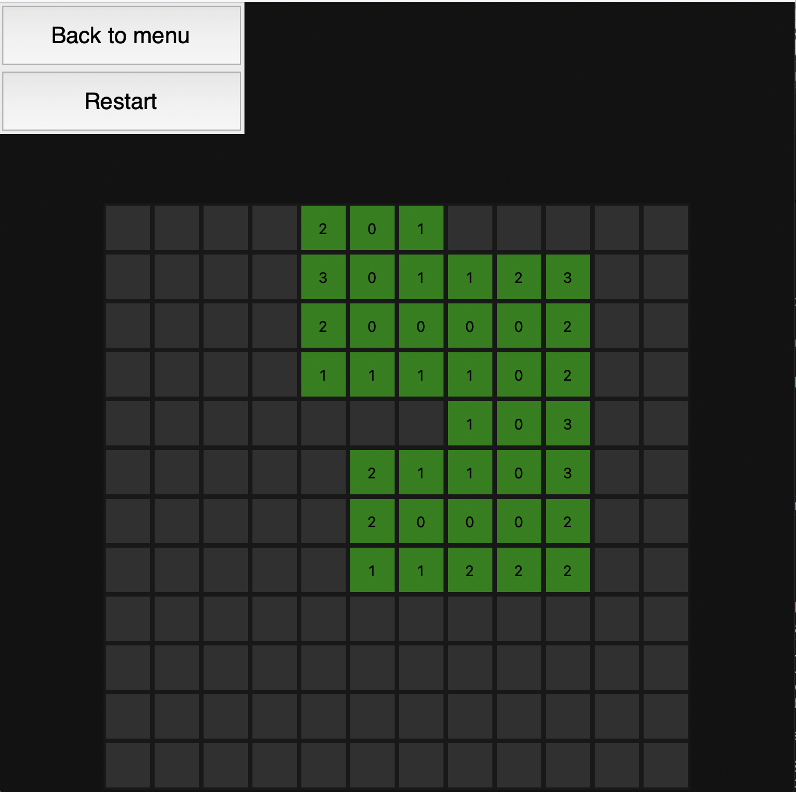
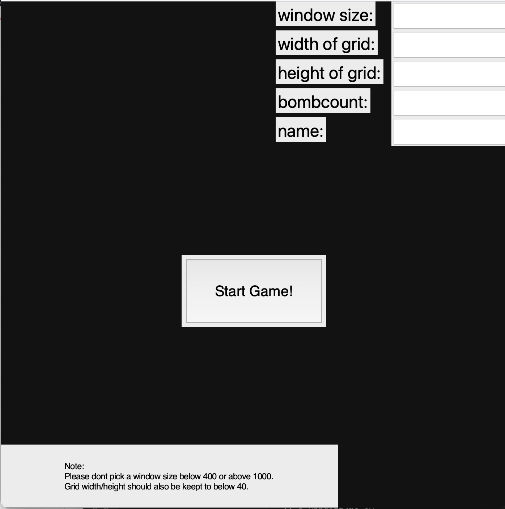

# MineweeperApp

 Developed as part of the course DD1331. It has costumizable grid sizes for different difficulties and window sizes, a scoreboard functionality and all the functionality one would expect of a minesweeper game.

<figure>
    
    <figcaption>View of the game.</figcaption>
</figure>

<figure>
    
    <figcaption>View of the main menu where it is possible to costumize the game.</figcaption>
</figure>
