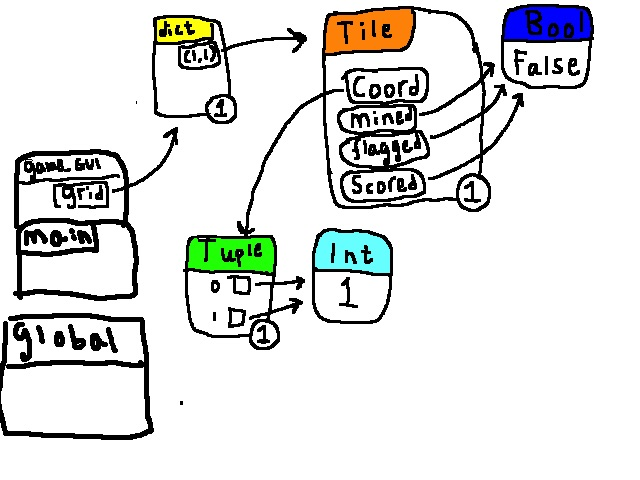

# Minesweeper - p-uppgift specification

## Inledning

Minesweeper är ett mycket välkänt spel som går ut på att röja ett fält från minor. Den ända informationen som fås är hur många minor som är bredvid en röjd bricka/kvadrat. När alla brickor som återstår är minor har man klarat nivån. Mer information kan fås på [minesweepers wikipediasida](https://en.wikipedia.org/wiki/Minesweeper_(video_game)).

Det finns flera utmanande steg i att koda ett spel såsom minesweeper. En av dessa är att hantera alla rutor eller brickor på ett bra sätt i ens kod. Detta kan tänkas göra med dictionary entries vars värden skulle kunna vara object i en klass som innehåller all information om en bricka såsom om den är minerad eller flagged osv.

En annan utmaning för detta project kommer troligt att vara det grafiska användargränssnittet. En anledning till detta är att ett stort antal knappar kommer att behöva genereras beroende på hur stor spelplanen specificeras att vara. En huvudmeny är också ett mål av detta project och med detta kommer utmaningen att byta mellan spelplannen och huvudmeny.

## Användarscenarier

### Förlust

Användare ett, Andreas, startar spelet och skriver in numrena 12 och 25 för spelplanets storklek och antalet minor respektivt. Andreas startar sedan själva spelet genom att trycka på en startknapp. Andreas ser nu ett rutfält med dimensionerna 12 x 12 (inmatade storleken kvadrerad) och två informationsrutor, ett för tiden som passerat sedan spelet började och ett annat som innehåller scoreboarden där andra personers tider visas (endast personer som klarat en nivå med likadana mängder rutor och minor). Scoreboarden är dock tom då ingen har klarat en nivå med dessa inställningar ännu. Andreas börjar sedan med att klicka på en av brickorna, bricka (1, 1). Den innehåller inte en mina och visar nu siffran ett. Andreas vet nu att i en av brickorna direkt bredvid bricka men han väljer att chansa och klickar på bricka (1, 2). Denna innehåller dock tyvärr en bomb och det vissas genom en röd bricka. Andreas visas nu en ruta där det står att han exploderade samt hur långt tid han spelade, hur många lediga rutor av totala antalet han lyckades identifiera och två knappar, quit to menu och play again. Andreas trycker på quit to menu och trycker sedan på quit game och går därmed ut ur spelet.

### Vinst

Användare två, Kevin, startar spelet och skriver, på samma sätt som Andreas, in numrena för spelplanets storlek och antalet minor. Kevin vill dock ha det lite lättare och skriver in 8 som spelplanets storlek och 10 som antalet minor. Kevin trycker på startknappen och ser, likt Andreas, en timer men olikt Andreas nivå finns det tidigare data från en person som klarat en likadan nivå. Kevin börjar röja minor. Det går bra för kevin och han lyckas identifiera alla icke-minerade rutor. Kevin visas nu en ruta där det står att han klarade nivån, han visas även hur långt tid det tog att klara nivån, hur många lediga rutor han identifierade och knapparna quit to menu och play again. Kevin väljer play again och kan nu sitt eget namn i scoreboarden längst upp, hans tid var nämligen snabbare än den andra personen som klarat nivån. Kevin fortsätter spela tills han fått en ännu bättre tid. Nästa gång han spelar är han fortfarande längst upp men med en ny tid, hans gamla har blivit ersatt av en ny bättre tid (om Kevin hade klarat nivån med en sämre tid än sin bästa så hade ingenting hänt).

## Kodskelett

```python
class Tile:
    def __init__ (coordinates, mined = False, flagged = False, scored = False):
        """Skapar ett tile object som innehåller information om en bricka/ruta på spel-rutnätet."""
        pass 

    def add_mine ():
        """Adds a mine to tile (changes mined bool to true)"""
        pass

    def flag ():
        """Adds a flag to tile and removes the flag if one is already present"""
        pass

    def score ():
        """Marks the tile as having been scored, one tile can only be scored once. When all tiles free from mines have been scored, 
        the level has been completed."""
        pass

def read_scoreboard(nbr_of_lines):
    """Returns the top {nbr_of_lines} names and times from the scoreboard"""
    pass


def add_to_scoreboard(name, time, gridsize, bombcount):
    """Adds information about a highscore to the scoreboard.txt textfile"""
    pass

def generate_grid(gridsize, minecount):
    """Generates a number of Tile class objects in a dictionary (keys are coordinates, values are the objects). 
    The number of value-key pairs will be gridsize squared. 
    This funciton will then loop through them all and randomly call the add_mine function for some (minecount) of the objects."""
    pass

def game_GUI(gridsize, minecount):
    """Removes the previous GUI_interface. Calls the generate grid function. Also
    packs the buttons and information needed for the user to play the "game" component into the tk window"""
    pass

def menu_GUI():
    """Removes the previous GUI_interface. Packs buttons and information needed for the user to configure the games gridsize and bombcount, 
    start the game or exit the application."""
    pass


def main():
    """Creates the tk window and calls the menu_GUI and main_game_GUI when certain actions have happened 
    (for example, the user pressing the start game button calls the game_GUI function)."""
    pass
```

## Minnet

I det enklaste fallet finns en tile i coordinaterna (1, 1) som är oflaggad, icke-minerad och ej clickats.

.
